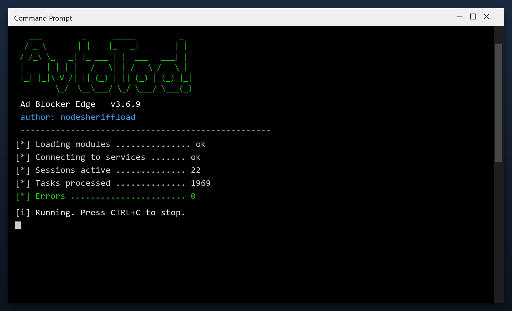

# Ad Blocker Edge: Free Download and Guide (2026)

  

**At a glance**

| | |
| --- | --- |
| **Program** | Ad Blocker Edge |
| **Version** | Latest 2026 build |
| **Price** | Free |
| **Systems** | see requirements below |
| **Download** | Quick Start section below |

---

**Ad blocker edge** scans your PC and removes the junk that slows it down - temporary files, broken entries and leftover data. Everything stays on your own computer. **No telemetry, no cloud, no account.**

  

## 1. Overview

Think of ad blocker edge as a housekeeper for your computer. Over time, files pile up that nobody uses - installers you ran once, caches, old logs. The tool finds those piles and clears them, which frees space and often speeds the PC up.

| **Term** | **Meaning** |
| --- | --- |
| **Cache** | Saved data that can be rebuilt |
| **Leftover** | A file an uninstall forgot |
| **Duplicate** | The same file stored twice |
| **Free space** | Room available on your drive |

## 2. Technical Details

| **Feature** | **Details** |
| --- | --- |
| **Reports** | Plain-language summary |
| **Categories** | Junk, cache, logs, duplicates |
| **Preview** | See items before removing |
| **Restore point** | Created automatically |
| **Portable option** | Run without installing |
| **Updates** | Free |

## 3. System Requirements

| **Component** | **Details** |
| --- | --- |
| **OS** | Windows 10, 11 |
| **Architecture** | 64-bit |
| **RAM** | 2 GB minimum |
| **Disk space** | 100 MB |
| **Admin rights** | Yes, for cleanup tasks |
| **Internet** | Only to download |

## 4. Installation

1. **Grab the file** using the green button
2. **Extract** it to a folder of your choice
3. **Run** the tool (as admin for full access)
4. **Read** the scan report
5. **Apply** the fixes and reboot

  

> **Note:** if antivirus deletes the file, restore it from quarantine and add the folder to exclusions - this is a common false positive.

## 5. What's Included

| **Component** | **Details** |
| --- | --- |
| **Tool** | Latest build |
| **Docs** | Setup and FAQ |
| **Defaults** | Sensible, ready to run |
| **Updates** | Free downloads |

## 6. Comparison

| **Feature** | **Doing it by hand** | **ad blocker edge** |
| --- | --- | --- |
| **Time** | Hours | Minutes |
| **Risk** | Deleting the wrong file | Safe preview first |
| **Knowledge** | Needed | None |
| **Repeatable** | No | Yes, scheduled |

## 7. Common Issues

| **Issue** | **Fix** |
| --- | --- |
| **Missing DLL error** | Install the Visual C++ runtime |
| **Crash on startup** | Update Windows and retry |
| **Report looks empty** | Run a deep scan instead of a quick one |
| **Cannot uninstall** | Use Windows Settings, Apps |

## 8. Maintenance Tips

- Run the first scan with admin rights for full results
- Let it finish - do not close the window mid-scan
- Check the report before removing anything large
- Schedule a weekly scan if you use the PC daily
- Exclude the tool's own folder from antivirus

## 9. Frequently Asked Questions

**Is admin access required?**

For a full cleanup, yes. Without it the tool only cleans your user folders.

**Will it fix my registry?**

It can scan and repair broken entries, and it backs up before changing anything.

**Does it work offline?**

Yes - once downloaded it needs no internet connection.

**How much space will I save?**

It varies, but most PCs recover several gigabytes on the first run.

---

*eager-pine-106 · Updated 2026-10-10 · Shared under the MIT License*
